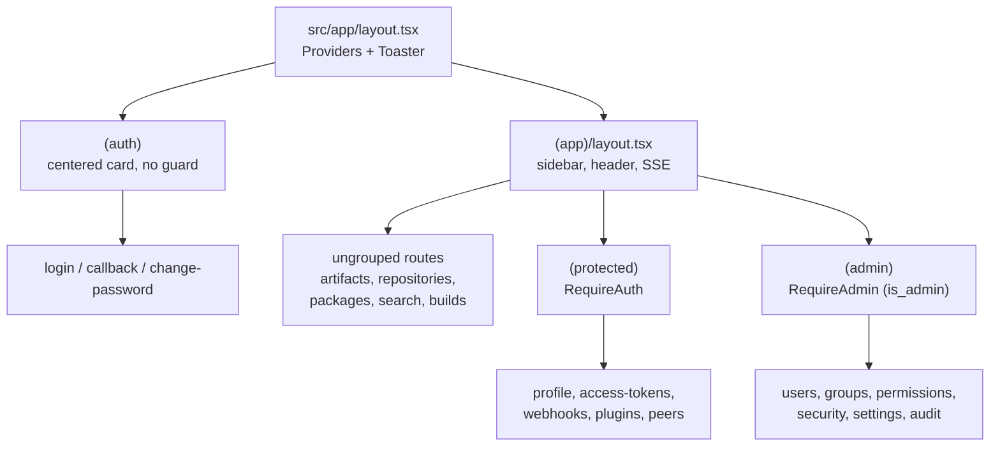

# 架构

本文档描述 Artifact Keeper Web 前端是如何组织起来的，以及维护者在修改它时需要牢记的规则。它面向的是正在编辑本仓库的人，而不是最终用户。产品文档请参见 artifactkeeper.com。

该项目是一个 Next.js 15 App Router 项目（React 19、TypeScript、Tailwind CSS 4）。它通过生成的 OpenAPI SDK 与 Rust 后端通信，并在运行时将 API 流量代理到该后端。服务端状态存放在 TanStack Query 中；客户端状态极少。

## 路由架构

所有内容都位于 `src/app` 下。App Router 使用路由组（括号目录名，不会产生 URL 段）来为树的不同部分挂载不同的布局与认证边界。

- `(auth)` 承载未认证的流程：`login`、`callback`（SSO 授权码交换落在这里）以及 `change-password`。它的布局只在渐变背景上居中显示一张卡片，除此之外不做任何事。这里的页面不得假设用户已登录。
- `(app)` 是已认证的壳。它的布局（`src/app/(app)/layout.tsx`）渲染侧边栏、顶栏、演示横幅与密码过期横幅，并挂载 `EventStreamProvider`（SSE 连接，见数据层）。进入产品后可见的一切都挂在这下面。
- 在 `(app)` 内部有两个嵌套组，它们的存在纯粹是为了应用认证守卫：
  - `(protected)` 用 `RequireAuth` 包裹其子节点。任何已认证用户都可以访问这些页面（个人资料、访问令牌、Webhook、插件、对等实例、复制）。
  - `(admin)` 用 `RequireAdmin` 包裹其子节点。这些页面额外要求 `user.is_admin`，并将非管理员重定向到 `/error/403`（用户、组、权限、安全、设置、审计等）。
- 直接位于 `(app)` 下、没有 `(protected)` 或 `(admin)` 包裹的页面（artifacts、repositories、packages、search、builds、staging、setup）会渲染在已认证壳内，但不会由布局单独守卫。它们依赖壳本身，以及数据层上的 `RequireAuth` 语义，而不是专用的守卫组件。

`src/app/api` 包含少量 Next.js 路由处理器，它们在服务器上运行而非代理到后端。值得注意的是 `api/v1/events/stream` —— SSE 端点，它需要一个真正的流式路由处理器，因为中间件代理会缓冲并关闭它。

与功能相关的代码与路由放在一起。一个路由目录可以包含 `_components/` 与 `_lib/` 子文件夹（下划线前缀使它们不会被纳入路由）。共享 UI 位于 `src/components`，共享逻辑位于 `src/lib`。



守卫（`src/components/auth/require-auth.tsx` 与 `require-admin.tsx`）是客户端组件，它们读取认证上下文并通过路由器重定向。在认证解析期间它们渲染加载状态，一旦决定重定向则返回 `null`，因此受保护的页面绝不会为未授权用户短暂闪现。由于守卫在客户端运行，它们只是一种用户体验手段，而非安全边界。后端会在每个请求上强制执行授权；守卫只决定渲染什么。

## 数据层

API 访问按顺序流经三层：

1. 生成的 SDK `@artifact-keeper/sdk`，发布自 `artifact-keeper-api` 仓库。它为每个后端操作暴露一个带类型的函数（`listRepositories`、`createRepository` 等），外加请求与响应类型。它是 `package.json` 中的一个普通依赖，并已列入 `next.config.ts` 的 `transpilePackages`。
2. `src/lib/api` 中的手写包装器，每个领域一个模块（`repositories.ts`、`artifacts.ts`、`security.ts` 等），各自从 `src/lib/api/index.ts` 导出。包装器调用 SDK，解包 `{ data, error }` 结果（遇到 `error` 时抛出，用 `assertData` 断言非空），并将 SDK 类型适配为应用本地的 `@/types` 形态。这个适配边界是刻意为之：`narrowEnum` 将后端自由的字符串（例如仓库 `format`）映射到应用更窄的联合类型，当后端新增了前端尚未建模的值时，它会回退并输出一条控制台警告，而不是崩溃。
3. 组件中的 TanStack Query Hooks。组件用 `queryFn`（内部调用包装器）调用 `useQuery`/`useMutation`。它们不会直接导入 SDK。

有些端点尚不在生成的 SDK 中（路由规则、上游认证、年龄策略以及其他较新的字段）。这些包装器回退到 `src/lib/api/fetch.ts` 中的 `apiFetch` —— 一个轻量 `fetch` 辅助函数，负责解析基础 URL、发送凭据并处理空响应体。这是已文档化的临时方案，而非首选路径。具体模式请参见 `repositories.ts` 中的注释。

### SDK 客户端与认证

`src/lib/sdk-client.ts` 配置唯一的全局 SDK 客户端，必须在任何 SDK 调用之前作为副作用导入（`import '@/lib/sdk-client'`）。包装器与认证提供方都在文件顶部这么做。它设置了：

- `credentials: 'include'`，以便浏览器发送后端的 httpOnly 认证 Cookie。`localStorage` 中没有令牌；认证提供方的 `storeTokens` 刻意设计为空操作。
- 一个请求拦截器，在选中远程实例时为代理路径添加前缀。它只改写路径名，绝不改写主机，以避免通过被污染的 `localStorage` 实例条目引发开放重定向。
- 一个响应拦截器，处理 `401` 时调用一次 `/auth/refresh`（由互斥锁保护，避免并发 401 造成刷新风暴）并重试；遇到 `403 SETUP_REQUIRED` 响应体时重定向到 `/login`。

### 实时更新

当用户存在时，`useEventStream`（`src/hooks/use-event-stream.ts`）会打开 SSE 连接，并将后端领域事件翻译为 TanStack Query 缓存失效。`src/lib/query-keys.ts` 是唯一的事实来源：它定义了查询键常量、每个领域的失效分组，以及从 SSE 事件类型到分组的映射。任何变更也会通过 `query-provider.tsx` 中的全局 `MutationCache` 处理器使仪表盘分组失效。

### 当后端新增端点时如何添加 API 调用

完整的流水线（后端的 utoipa 注解 → OpenAPI 规范 → SDK → 前端）在仓库根目录的 `CLAUDE.md` 中有描述。在本侧：

1. 让新操作进入 SDK。发布时 `artifact-keeper-api` 仓库会重新生成 `@artifact-keeper/sdk`；在此处升级依赖即可获取。如果你领先于某个发布，请使用上述 `apiFetch` 回退方案，并留下指向后端问题的注释。
2. 在 `src/lib/api` 中添加或扩展一个包装器，将 SDK 类型适配为 `@/types`，并从 `index.ts` 导出。
3. 如果数据参与实时更新或跨视图失效，请在 `src/lib/query-keys.ts` 中添加查询键，并接入 SSE 事件映射。
4. 在组件中使用 `useQuery`/`useMutation` 消费它。

## 组件约定

UI 构建在 shadcn/ui（"new-york" 风格）之上，底层是 Radix 原语。`components.json` 记录了配置；其中的别名（`@/components`、`@/components/ui`、`@/lib`、`@/hooks`）与 `tsconfig.json` 中的 `@/*` 路径匹配。

- `src/components/ui` 存放生成的 shadcn 原语（button、dialog、table、sidebar 等）。请将它们视为外部引入（vendored）代码：通过 shadcn 工作流重新生成或编辑，而不是手工分叉，这样后续新增的组件才能保持一致。图标来自 `lucide-react`。
- `src/components` 还存放按领域分组的共享应用组件（`auth`、`layout`、`package`、`search`、`common`、`dt`）。
- 与功能相关的组件位于路由的 `_components` 文件夹中。
- Toast 通过根布局中挂载的 `Toaster` 使用 `sonner`；`src/lib/error-utils.ts` 中的 `mutationErrorToast` 是标准的变更错误处理器。

样式使用 Tailwind CSS 4，全部在 `src/app/globals.css` 中配置（没有 `tailwind.config`）。颜色是 CSS 自定义属性，以 `:root` 下的 `oklch(...)` 定义，并在 `.dark` 下覆盖，通过 `@theme inline` 暴露给 Tailwind。请使用语义令牌（`bg-background`、`text-foreground`、`bg-muted`、`border-border` 等）而非原始调色板值，以确保两种主题都保持正确。深色模式基于类（`@custom-variant dark`），由 `next-themes` 驱动（`attribute="class"`、`defaultTheme="system"`）。设计以深色模式为先，因此当你改动视觉代码时，请同时验证两种主题。

## 状态规则

- 服务端状态属于 TanStack Query。任何来自后端的数据都是一个查询或变更，通过 `src/lib/query-keys.ts` 作为键（视图局部数据用本地键）。不要将获取到的数据复制进 `useState`。默认查询选项位于 `query-provider.tsx`：两分钟 `staleTime`（实时新鲜度由 SSE 负责）、一次重试，以及在聚焦与重连时重新获取。
- 跨切面的客户端状态存放在一小撮上下文提供方中，在 `src/providers/index.tsx` 中组合（顺序很重要：Instance、Query、SystemConfig、Theme、Auth）：
  - `AuthProvider` 在内存中保存当前用户与认证流程标志（登录、登出、TOTP、必须修改密码）。会话持久化由后端的 httpOnly Cookie 负责，而非这个状态。
  - `InstanceProvider` 管理活动/远程实例列表，持久化在 `localStorage` 的 `ak_instances` / `ak_active_instance` 下。
  - `SystemConfigProvider` 暴露后端的公共运行时配置与派生的功能开关；它本身就是一个带缓存的查询，并且总是返回一个具体的默认值，因此消费者永远不需要做空值检查。
  - `ThemeProvider`（next-themes）拥有主题，由该库负责持久化。
  - 侧边栏的展开/收起状态由 shadcn 的 `SidebarProvider` 拥有。
- 其余一切都是表单字段与局部 UI 的普通组件 `useState`。

## 维护者不得破坏的不变量

- SDK 是生成的，不是在这里编写的。绝不要手工编辑 `node_modules` 中的 `@artifact-keeper/sdk`，也不要引入分叉版本。新端点来自 OpenAPI 流水线；本地的逃生通道是 `apiFetch`，并且一定要附上指向后续后端工作的注释，说明该工作将使其变得不再必要。
- 按层调用。组件调用包装器，包装器调用 SDK。不要把 SDK 函数直接导入组件；并把 SDK 到 `@/types` 的适配（包括 `narrowEnum` 回退）留在包装器中，这样后端新增的枚举值会优雅降级而不是抛出异常。
- 在任何 SDK 使用之前，导入 `@/lib/sdk-client` 以获得其副作用；并保持基于 Cookie 的认证：`credentials: 'include'`，`localStorage` 中无令牌。不要让远程实例拦截器改写协议或主机。
- 路由组的位置就是认证契约。需要登录的页面放在 `(protected)` 下；仅管理员可访问的页面放在 `(admin)` 下。把页面移出其分组会悄然移除它的守卫。请记住这些守卫是客户端的用户体验；真正的授权是后端的事，因此绝不要依赖它们来隐藏后端本会返回的数据。
- 保持查询键及其失效逻辑都在 `src/lib/query-keys.ts` 中。如果你新增了一个会接收实时更新的领域，请在那里注册它的键、失效分组与 SSE 事件映射，而不是到处散落 `invalidateQueries` 调用。
- 代理发生在运行时，而非构建时。`src/middleware.ts` 在每次请求时读取 `BACKEND_URL`，并将 `/api/*`、`/health`、`/v2/*` 以及原生包格式前缀重写到后端，因此无需重新构建即可为容器重新指定目标。当你在后端新增一个原生格式前缀时，请把它加到中间件的 `matcher` 中。除非你理解 `next.config.ts` 中内联记录的 Docker Registry v2 与上传大小的原因，否则请勿改动 `skipTrailingSlashRedirect` 与 `proxy*` 大文件上传相关设置。
- Lint 必须通过。`npm run lint` 使用 `next/core-web-vitals` 与 TypeScript 配置运行 eslint；`no-explicit-any` 仅在测试文件中放宽。样式通过 Tailwind 令牌与 shadcn 原语，而不是一次性 CSS。

## 本地开发

```bash
npm install
npm run dev     # http://localhost:3000
npm run build
npm run lint
npm run test    # vitest 单元测试
npm run test:e2e  # playwright
```

为浏览器侧 SDK 基础 URL 设置 `NEXT_PUBLIC_API_URL`，为服务器侧中间件代理目标设置 `BACKEND_URL`（默认 `http://backend:8080`，即 Docker Compose 服务名）。完整的本地技术栈请参见后端仓库中的 `.env.example` 与工作区根目录的 `CLAUDE.md`。
