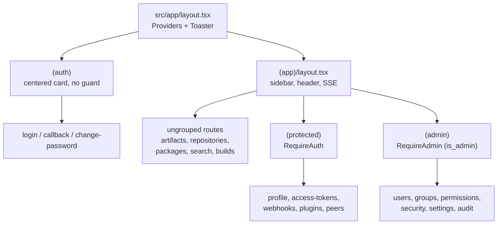

# Architecture

This document describes how the Artifact Keeper web frontend is put together and
the rules a maintainer needs to keep in mind when changing it. It is written for
people editing this repository, not for end users. For product docs see
artifactkeeper.com.

The app is a Next.js 15 App Router project (React 19, TypeScript, Tailwind CSS
4). It talks to the Rust backend through a generated OpenAPI SDK and proxies API
traffic to that backend at runtime. Server state lives in TanStack Query; there
is very little client state.

## Route architecture

Everything lives under `src/app`. The App Router uses route groups (parenthesized
directory names that do not produce a URL segment) to attach different layouts
and auth boundaries to different parts of the tree.

- `(auth)` holds the unauthenticated flows: `login`, `callback` (SSO code
  exchange lands here), and `change-password`. Its layout centers a card on a
  gradient background and does nothing else. Pages here must not assume a logged
  in user.
- `(app)` is the authenticated shell. Its layout (`src/app/(app)/layout.tsx`)
  renders the sidebar, header, demo and password-expiry banners, and mounts
  `EventStreamProvider` (the SSE connection, see Data layer). Everything visible
  once you are inside the product hangs off here.
- Within `(app)` there are two nested groups that exist purely to apply an auth
  guard:
  - `(protected)` wraps its children in `RequireAuth`. Any authenticated user
    can reach these pages (profile, access tokens, webhooks, plugins, peers,
    replication).
  - `(admin)` wraps its children in `RequireAdmin`. These pages additionally
    require `user.is_admin` and redirect non-admins to `/error/403` (users,
    groups, permissions, security, settings, audit, and so on).
- Pages that sit directly under `(app)` without a `(protected)` or `(admin)`
  wrapper (artifacts, repositories, packages, search, builds, staging, setup)
  render inside the authenticated shell but are not individually guarded by a
  layout. They rely on the shell and on `RequireAuth` semantics at the data
  layer rather than a dedicated guard component.

`src/app/api` contains a small number of Next.js route handlers that run on the
server rather than proxying to the backend. The notable one is
`api/v1/events/stream`, the SSE endpoint, which needs a real streaming route
handler because the middleware proxy would buffer and close it.

Feature-local code is colocated with the route. A route directory may contain
`_components/` and `_lib/` subfolders (the underscore prefix keeps them out of
routing). Shared UI lives in `src/components`, shared logic in `src/lib`.



The guards (`src/components/auth/require-auth.tsx` and `require-admin.tsx`) are
client components that read the auth context and redirect with the router. They
render a loading state while auth is resolving and `null` once they decide to
redirect, so a protected page never briefly flashes for an unauthorized user.
Because the guards are client-side, they are a UX affordance, not a security
boundary. The backend enforces authorization on every request; the guards only
decide what to render.

## Data layer

API access flows through three layers, in this order:

1. The generated SDK, `@artifact-keeper/sdk`, published from the
   `artifact-keeper-api` repo. It exposes one typed function per backend
   operation (`listRepositories`, `createRepository`, and so on) plus request
   and response types. It is a plain dependency in `package.json` and is listed
   in `transpilePackages` in `next.config.ts`.
2. Hand-written wrappers in `src/lib/api`, one module per domain
   (`repositories.ts`, `artifacts.ts`, `security.ts`, and so on), each exported
   from `src/lib/api/index.ts`. A wrapper calls the SDK, unwraps the
   `{ data, error }` result (throwing on `error`, asserting non-empty with
   `assertData`), and adapts SDK types into the app's local `@/types` shapes.
   This adapter boundary is deliberate: `narrowEnum` maps a free-form backend
   string (for example a repository `format`) onto the app's narrower union and
   falls back with a console warning instead of crashing when the backend adds a
   value the frontend does not model yet.
3. TanStack Query hooks in components. Components call `useQuery`/`useMutation`
   with a `queryFn` that calls a wrapper. They do not import the SDK directly.

Some endpoints are not in the generated SDK yet (routing rules, upstream auth,
age policy, and other newer fields). Those wrappers fall back to `apiFetch` in
`src/lib/api/fetch.ts`, a thin `fetch` helper that resolves the base URL, sends
credentials, and handles empty bodies. This is a documented stopgap, not the
preferred path. See the comments in `repositories.ts` for the pattern.

### The SDK client and auth

`src/lib/sdk-client.ts` configures the single global SDK client and must be
imported for side effects before any SDK call (`import '@/lib/sdk-client'`). The
wrappers and the auth provider all do this at the top of the file. It sets:

- `credentials: 'include'` so the browser sends the backend's httpOnly auth
  cookies. There are no tokens in `localStorage`; the auth provider's
  `storeTokens` is intentionally a no-op.
- A request interceptor that, when a remote instance is selected, prefixes the
  proxy path. It only rewrites the pathname, never the host, to avoid an
  open-redirect via a poisoned `localStorage` instance entry.
- A response interceptor that handles `401` by calling `/auth/refresh` once
  (guarded by a mutex so concurrent 401s do not stampede the refresh) and
  retrying, and handles a `403 SETUP_REQUIRED` body by redirecting to `/login`.

### Live updates

`useEventStream` (`src/hooks/use-event-stream.ts`) opens the SSE connection when
a user is present and translates backend domain events into TanStack Query cache
invalidations. `src/lib/query-keys.ts` is the single source of truth: it defines
the query key constants, the invalidation groups per domain, and the mapping from
SSE event type to group. Any mutation also invalidates the dashboard group via
the global `MutationCache` handler in `query-provider.tsx`.

### Adding an API call when the backend adds an endpoint

The full pipeline (backend utoipa annotations to OpenAPI spec to SDK to
frontends) is described in the workspace root `CLAUDE.md`. On this side of it:

1. Get the new operation into the SDK. On a release the `artifact-keeper-api`
   repo regenerates `@artifact-keeper/sdk`; bump the dependency here to pick it
   up. If you are ahead of a release, use the `apiFetch` fallback described above
   and leave a comment pointing at the backend issue.
2. Add or extend a wrapper in `src/lib/api`, adapting SDK types to `@/types` and
   exporting it from `index.ts`.
3. If the data participates in live updates or cross-view invalidation, add a
   query key to `src/lib/query-keys.ts` and wire the SSE event mapping.
4. Consume it from a component with `useQuery`/`useMutation`.

## Component conventions

UI is built on shadcn/ui (the "new-york" style) over Radix primitives.
`components.json` records the config; the aliases there (`@/components`,
`@/components/ui`, `@/lib`, `@/hooks`) match the `@/*` path in `tsconfig.json`.

- `src/components/ui` holds the generated shadcn primitives (button, dialog,
  table, sidebar, and so on). Treat these as vendored: regenerate or edit them
  through the shadcn workflow rather than hand-diverging, so future component
  additions stay consistent. Icons come from `lucide-react`.
- `src/components` also holds shared app components grouped by area (`auth`,
  `layout`, `package`, `search`, `common`, `dt`).
- Feature-specific components live in the route's `_components` folder.
- Toasts use `sonner` through the `Toaster` mounted in the root layout;
  `mutationErrorToast` in `src/lib/error-utils.ts` is the standard mutation
  error handler.

Styling is Tailwind CSS 4, configured entirely in `src/app/globals.css` (there
is no `tailwind.config`). Colors are CSS custom properties defined as
`oklch(...)` under `:root` and overridden under `.dark`, surfaced to Tailwind
via `@theme inline`. Use the semantic tokens (`bg-background`, `text-foreground`,
`bg-muted`, `border-border`, and so on) rather than raw palette values so both
themes stay correct. Dark mode is class-based (`@custom-variant dark`) and driven
by `next-themes` (`attribute="class"`, `defaultTheme="system"`). The design is
dark-mode-first, so verify both themes when you touch visual code.

## State rules

- Server state belongs in TanStack Query. Anything that comes from the backend is
  a query or mutation keyed through `src/lib/query-keys.ts` (or a local key for
  view-local data). Do not copy fetched data into `useState`. Default query
  options live in `query-provider.tsx`: a two minute `staleTime` (SSE handles
  real-time freshness), one retry, and refetch on focus and reconnect.
- Cross-cutting client state lives in a small set of context providers, composed
  in `src/providers/index.tsx` (order matters: Instance, Query, SystemConfig,
  Theme, Auth):
  - `AuthProvider` holds the current user and auth flow flags in memory (login,
    logout, TOTP, must-change-password). Session persistence is the backend's
    httpOnly cookies, not this state.
  - `InstanceProvider` manages the active/remote instance list, persisted in
    `localStorage` under `ak_instances` / `ak_active_instance`.
  - `SystemConfigProvider` exposes the backend's public runtime config and
    derived feature flags; it is itself a cached query and always returns a
    concrete default so consumers never null-check.
  - `ThemeProvider` (next-themes) owns the theme, persisted by that library.
  - Sidebar open/collapsed state is owned by shadcn's `SidebarProvider`.
- Everything else is ordinary component `useState` for form fields and local UI.

## Invariants a maintainer must not break

- The SDK is generated, not authored here. Never hand-edit `@artifact-keeper/sdk`
  in `node_modules` or vendor a fork. New endpoints come from the OpenAPI
  pipeline; the local escape hatch is `apiFetch`, always with a comment pointing
  at the backend work that will make it unnecessary.
- Go through the layers. Components call wrappers, wrappers call the SDK. Do not
  import SDK functions straight into a component, and keep the SDK-to-`@/types`
  adaptation (including `narrowEnum` fallbacks) in the wrapper so a new backend
  enum value degrades instead of throwing.
- Import `@/lib/sdk-client` for its side effect before any SDK use, and keep auth
  cookie-based: `credentials: 'include'`, no tokens in `localStorage`. Do not let
  the remote-instance interceptor rewrite protocol or host.
- Route group placement is the auth contract. A page that needs a login goes
  under `(protected)`; an admin-only page goes under `(admin)`. Moving a page out
  of its group silently drops its guard. Remember these guards are client-side
  UX; real authorization is the backend's job, so never rely on them to hide
  data that the backend would otherwise return.
- Keep query keys and their invalidations in `src/lib/query-keys.ts`. If you add
  a domain that receives live updates, register its key, invalidation group, and
  SSE event mapping there rather than scattering `invalidateQueries` calls.
- Proxying is runtime, not build time. `src/middleware.ts` reads `BACKEND_URL` on
  each request and rewrites `/api/*`, `/health`, `/v2/*`, and the native package
  format prefixes to the backend, so a container can be repointed without a
  rebuild. When you add a new native format prefix on the backend, add it to the
  middleware `matcher`. Leave `skipTrailingSlashRedirect` and the large-upload
  `proxy*` settings in `next.config.ts` alone unless you understand the Docker
  Registry v2 and upload-size reasons documented inline.
- Lint must pass. `npm run lint` runs eslint with `next/core-web-vitals` and the
  TypeScript config; `no-explicit-any` is relaxed only in test files. Styling
  goes through Tailwind tokens and shadcn primitives, not one-off CSS.

## Local development

```bash
npm install
npm run dev     # http://localhost:3000
npm run build
npm run lint
npm run test    # vitest unit tests
npm run test:e2e  # playwright
```

Set `NEXT_PUBLIC_API_URL` for the browser-side SDK base URL and `BACKEND_URL`
for the server-side middleware proxy target (default `http://backend:8080`, the
Docker Compose service name). See `.env.example` in the backend repo and the
workspace `CLAUDE.md` for the full local stack.
